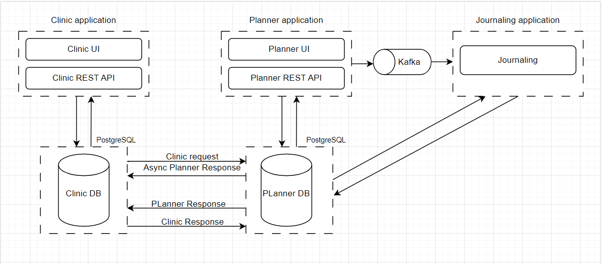

# Приложение Sport-planner
[English version bellow](#Sports-planner-application)

  
  
  

Это приложение состоит из трёх небольших микросервисов, по-разному взаимодействующих друг с другом. 

Благодаря одной части приложения пользователь может записывать результаты своих тренировок, турниров, писать и читать
статьи, а также отслеживать результаты проверки здоровья.

Другая же часть приложения имитирует функционал для врача, который должен вносить результат о проверке здоровья
спортсмена, прошедшего у него осмотр.
## Содержание:
- [Начало работы](##Начало-работы)
- [Технологии](##Технологии)
- [Архитектура](##Архитектура)
- [База данных](##База-данных)
- [Тестирование](##Тестирование)
- [Планируемые доработки](##Планируемые-доработки)
- [Контакты](##Контакты)

## Начало работы:
Для того, чтобы начать работать с приложением необходимо склонировать проект к тебе на машину командой:

    git clone https://github.com/VlasovM/Sports-planner.git

После установки проекта необходимо установить Docker desktop, сделать это можно по инструкции:

https://docs.docker.com/desktop/install/windows-install/

Далее вам необходимо зайти в папку проекта, открыть консоль и ввести команду:

    mvn clean package

После успешного выполнения данной команды необходимо проинициализировать и запустить контейнер с образами наших приложений.
Сделать это моожно командой: 

    docker compose up

В случае успеха всех предыдущих шагов, в интерфейсе Docker desktop отобразится контейнер **sports-planner** и 7 образов приложений.

Это значит, наши приложения готовы к работе.

Приложение **planner** будет доступно по ссылке: http://localhost:8080/

Доступные пользователи:
- VolkovLI@planner.ru | Volkov
- MoskvinVV@planner.ru | Moskvin
- EliseevaEA@planner.ru | Eliseeva

Приложение **clinic** будет доступно по ссылке: http://localhost:8091/

Доступные пользователи:
- VolkovLI@clinic.ru  | Volkov
- MoskvinVV@clinic.ru  | Moskvin
- EliseevaEA@clinic.ru  | Eliseeva

Инструкцию и данные для подключения к базам данных смотреть в разделе [База данных.](#База-данных)

## Технологии:
- Сборщик проектов: Maven
- Основной фреймвок: Spring Boot 3.3.0
- СУБД:
  - H2 v.2.2.220 (только для тестирования)
  - PostgreSQL v.42.6.0
- Тестирование:
  - JUnit 5
  - Mockito-core
  - Spring boot test
  - Spring security test
- Разработка фронтенда:
  - Spring thymeleaf
  - Jquery
- Другие зависимости:
  - Spring data jpa
  - Spring security
  - Spring kafka
  - Lombok
  - Map struct
  - Hibernate-validator
  - Docker

## Архитектура:

Взаимодействие между Planner-application и Journaling-application происходит через Kafka в односторонней связи
(только Planner отправляет данные в Journaling и никак иначе).

Между Clinic-application и Planner-application взаимодействие по REST.
<h2></h2>

## База данных:
Основная СУБД в проекте: **PostgreSQL**  
СУБД для тестов: **H2**

ER-диаграмма базы данных planner (модуль Planner + Journaling):
<h2></h2>

ER-диаграмма базы данных clinic (модуль Clinic):
<h2></h2>

## Тестирование:
Тесты написаны только для модуля Planner.
В основном тесты покрывают слои: repository (кастомные запросы), service, controller, mapper, handler.

Для слоя repository написаны интеграционные тесты с использованием H2.  
Для слоев service, mapper, handler используются mock тесты.  
Для слоя controller испольуется технология mockMvc.

## Планируемые доработки:
- Добавить аутентификацию через JWT;
- Написать тесты для модуля Clinic;
- Поменять базу данных для модуля Journaling с SQL на NoSQL;
- Добавить отчёт о покрытии кода тестами;
- Добавить Spring Cloud: Circuit Breaker, OpenFeign;

## Контакты:
По любым вопросам и предложениям можно писать мне в tg: https://t.me/JaVlasov

# Sports-planner application

  

